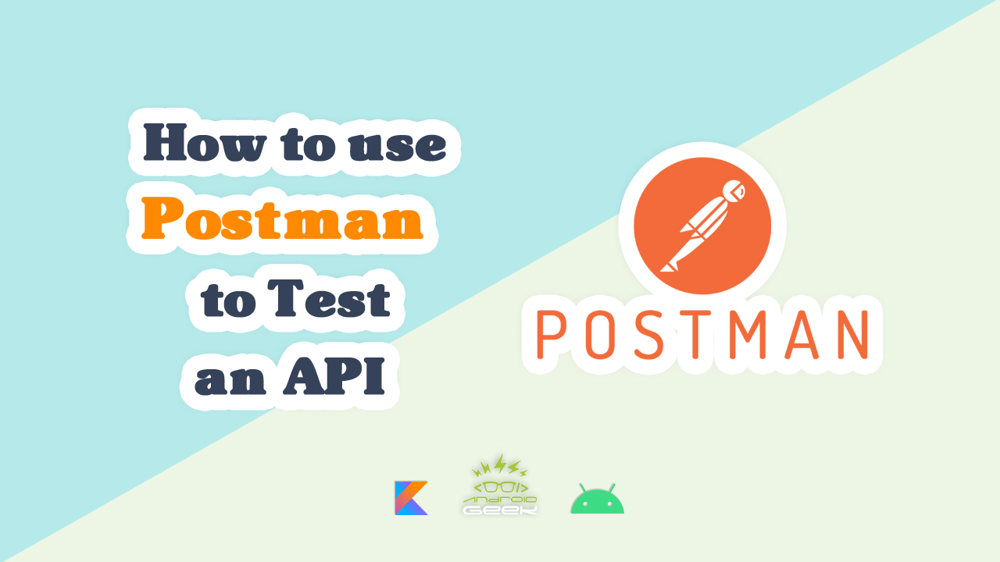

# PostmanJsonFile

</a>

YouTube Video :
   

 

Article on Medium:
 
https://medium.com/@ezatpanah/how-to-use-postman-to-test-an-api-a8eefdb1d321
 
 

✨ Join Medium to read thousands of valuable stories ✨
 
https://medium.com/@ezatpanah/membership
